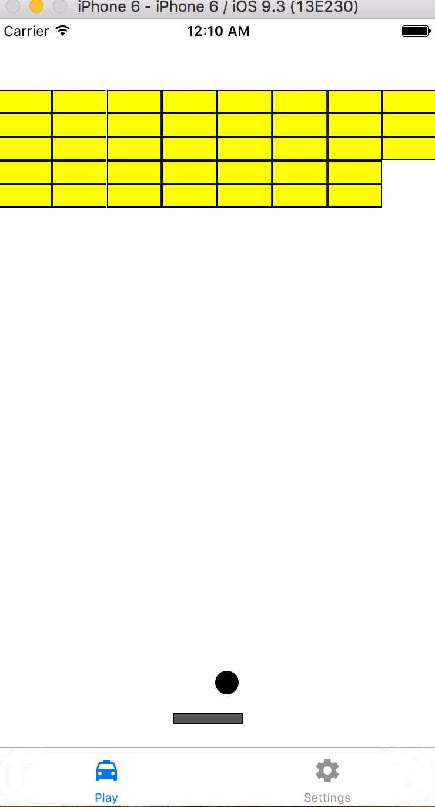

# Project 6 of CS193p from Stanford
## breakout game using Dynamic Animation in Swift
### Demo

It's a normal breakout game

We can configure things in the game like the radius of the ball, gravity, number of bricks, etc.

Of course we can also let the bricks affected by gravity..
